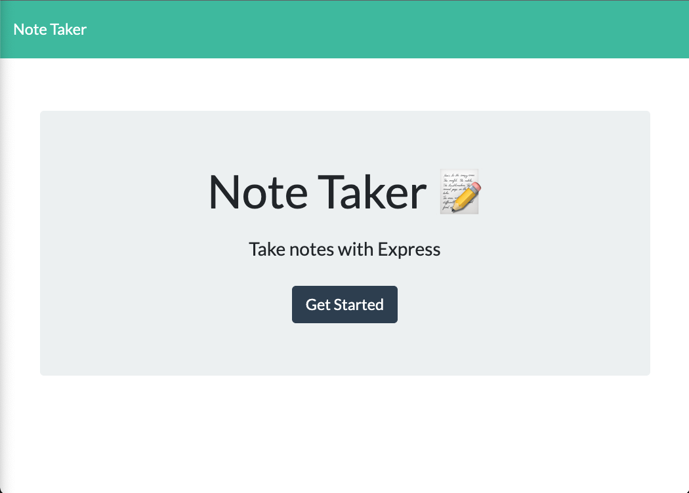
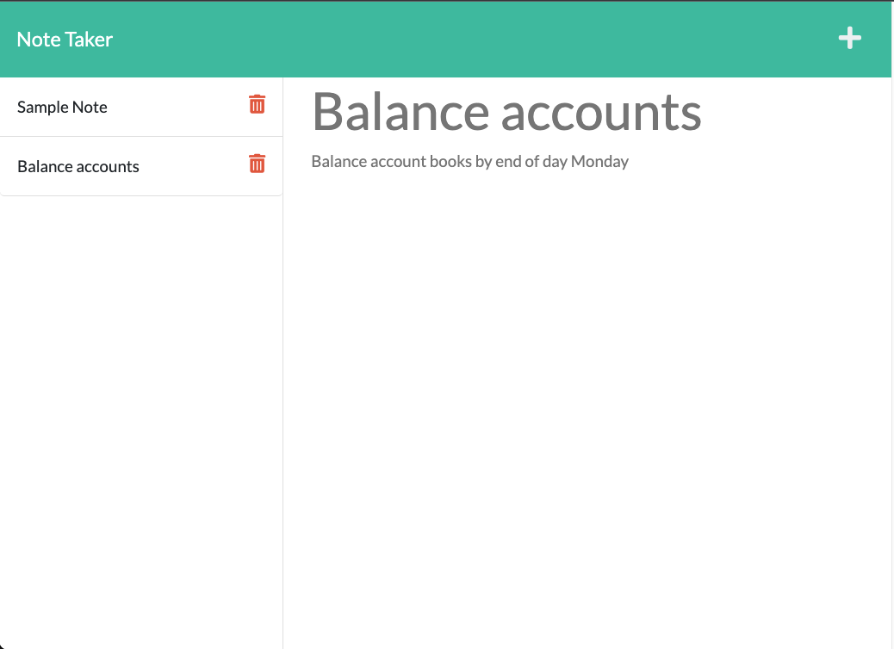

<!-- Note Taker ReadMe -->
# Note Taker

  

  ## Description

 I used Express.js to modify existing starter code in order to create a Note Taker applicatin that can be used to write, save, read and delete notes. 
  
  Click the link below to visit my deployed page.

  https://fenix-sampson-note-taker.herokuapp.com/

  <!-- [URL](undefined) -->

  ## Table of Contents
  
  * [Goals](#goals)

  * [Usage](#usage) 

  * [Installation](#installation)  

  * [Test](#test)

  * [Problems](#problems)

  * [Visualization](#visualization)

  * [Acknowledgements](#acknowledgements)

  * [Contributions](#contributions)

  * [Resources](#resources)

  * [License](#license) 

  * [Contact](#contact) 

  
  ## Goals

  In our constantly busy society it is extremely important In our constantly busy society it is extremely important to stay organized with your daily tasks, goals and responsiblities.  I wanted to create a Note Taker app that would allow those thoughts to be better organized into a concise and easy to read collection of notes.  

  ## Motivation

  My schedule is becoming increasingly full, I needed an application to help me better organize my activites.

  ## Usage

  This note taker application can be used to write, save, read and delete notes.

  ## Installation
  
  npm -i      node server.js     open in browser at localhost:3001  

  ## Test

  N/A

  ## Problems

  The delete function was a little difficult to figure out at first but with a little hard work I was able to get it working.

  ## Visualization

  

  

  ## Acknowledgements

  Many thanks to Brent Graves and Gabriel Cavalcante Causin for being excellent study partners and helping me to understand the topics that I needed assitance in.

  ## Contributions

  Email me or submit a pull request

  ## Resources
 
  Express.js
  Node.js
  Heroku

  ## License

  

  This projet uses MIT. 
  
  The link to the License can be found here (https://opensource.org/licenses/MIT)

  ## Contact
  
  GitHub Username: FenixS83 [@FenixS83](https://github.com/FenixS83)

  fenix.sampson@gmail.com

